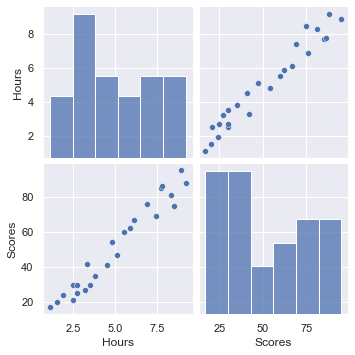
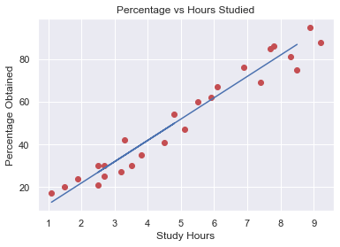

## Prediction using Supervised ML- Task 1

- Predict the percentage of an student based on the no. of study hours.
- This is a simple linear regression task as it involves just 2 variables.
- Using python using data preprocessing techniques analyze dataset.
- What will be predicted score if a student studies for 9.25 hrs/ day?
------------------------------------------
Exploring Student Scores dataset.

|       | Hours     | Scores    |
|-------|-----------|-----------|
| count | 25.000000 | 25.000000 |
| mean  | 5.012000  | 51.480000 |
| std   | 2.525094  | 25.286887 |
| min   | 1.100000  | 17.000000 |
| 25%   | 2.700000  | 30.000000 |
| 50%   | 4.800000  | 47.000000 |
| 75%   | 7.400000  | 75.000000 |
| max   | 9.200000  | 95.000000 |

Looking correlation in the dataset.

## Actual vs Predicted data

| Indexes | Actual_Values |     Predicted_values      |
|---------------|------------------|-----------|
| 0             | 75               | 86.907725 |
| 1             | 21               | 26.893308 |
| 2             | 25               | 28.893789 |
| 3             | 54               | 49.898835 |
| 4             | 17               | 12.889944 |

#### Linear regression model fitted exactly on the test data. Let's visualize that!

##### So for 9.25 hours of study the student obtains 94 marks.
